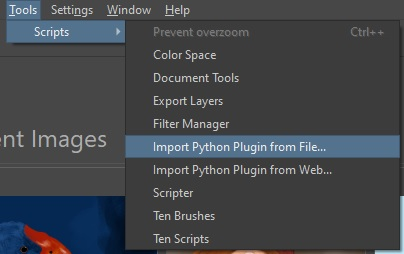
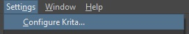
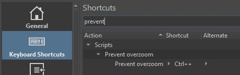

## Description
Zoom function for [krita](https://link-url-here.org) that does not zoom over 100%.

## Installation

### Download
Download the latest version [here](https://github.com/theTschi/krita-extension-prevent-overzoom/releases).

### Installation
Open krita and go to "Tools > Scripts > Import Python Plugin from File..."\
\
and then select the downloaded zip file.

### Remap shortcut
If the plugin does not work out of the box as it should, it might be a remapping problem.\
To fix this open "Settings > Configure Krita"\
\
and then remap your normal zoom in shortcut to Prevent overzoom.\

## Credits
[HMagellanLinux](https://www.youtube.com/@hmagellanlinux307)\
For his youtube channel. His videos helped me to start with this extension.\
[viksl](https://github.com/viksl)\
For his krita-plugin-custom-canvas-rotation code as a starting point.\
[nickgeneratorfailed](https://krita-artists.org/u/nickgeneratorfailed/summary) and [EyeOdin](https://krita-artists.org/u/EyeOdin/summary)\
For the [hint](https://krita-artists.org/t/canvas-class-what-does-zoomlevel-returns-compared-to-setzoomlevel-manual-link-inside/15702) to the factor depending on the resolution.

## License
Prevent overzoom as a whole is licensed under the GNU Public License, Version 3.
